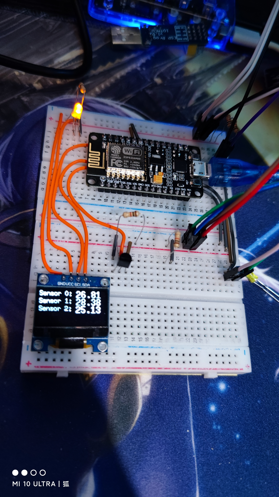
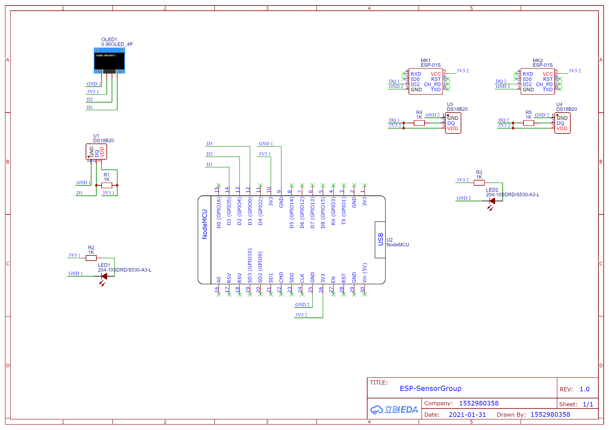
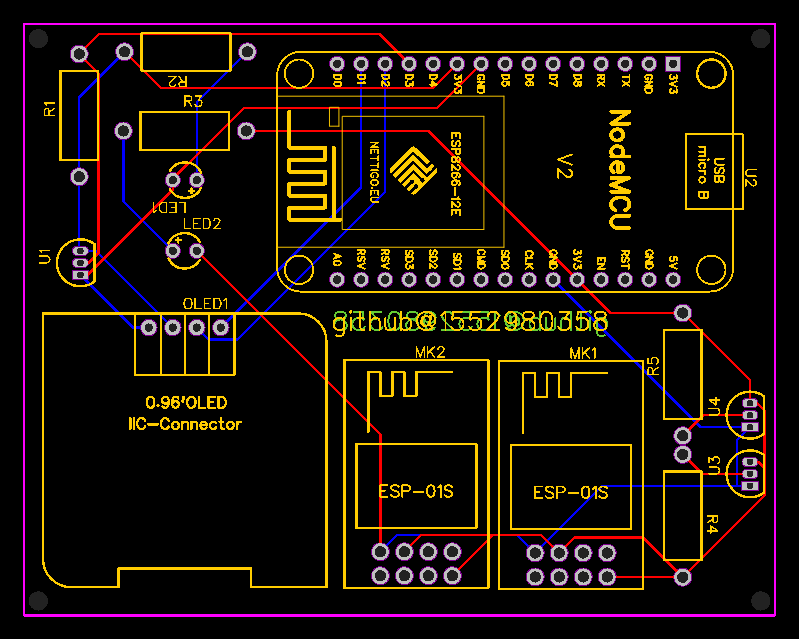

# ESP-SensorGroup

## Photo


## Build

### Hardware Requirement

- 1 wireless router
  - For data exchanging
  
- 3 ESP8266 boards
  - For handling data
  
- 1 PC
  - For compiling and flashing firmware to ESP devices
  
### Compiling software

  - `JetBrains CLion` ver 2020.3+ with `PlatformIO` plugin installed
  
### Compiling notice

  - 2 `wifi_metadata.h` header file should be created and edited before compiling firmware in both `<ProjectDir>/MainController/src` and `<ProjectDir>/SensorController/src` directory
  
  - `<ProjectDir>/MainController/src/wifi_metadata.h` should follow following example
    ```
    #ifndef MAINCONTROLLER_WIFI_METADATA_H
    #define MAINCONTROLLER_WIFI_METADATA_H

    const char *ssid = "wifi_ssid";         // Fill in SSID of your Wi-Fi 
    const char *password = "wifi.passwd";   // Fill in password of your Wi-Fi 

    IPAddress getIp0() {
        return IPAddress(192, 168, 1, 110); // Fill in IP address of ESP connected to sensor
    }

    IPAddress getIp1() {
        return IPAddress(192, 168, 1, 120); // Fill in another IP address of ESP connected to sensor
    }

    #endif //MAINCONTROLLER_WIFI_METADATA_H
    ```
  
  - `<ProjectDir>/SensorController/src/wifi_metadata.h` should follow following example
    ```
    #ifndef SENSORCONTROLLER_WIFI_METADATA_H
    #define SENSORCONTROLLER_WIFI_METADATA_H

    const char *ssid = "wifi_ssid";         // Fill in SSID of your Wi-Fi 
    const char *password = "wifi_passwd";   // Fill in password of your Wi-Fi 

    #endif //SENSORCONTROLLER_WIFI_METADATA_H
    ```

## Hardware Connection
    
### Schematic


### PCB 


### PDF
- [](PDF_ESP-SensorGroup.pdf)

### Gerber ZIP
- [](Gerber_ESP-SensorGroup.zip)